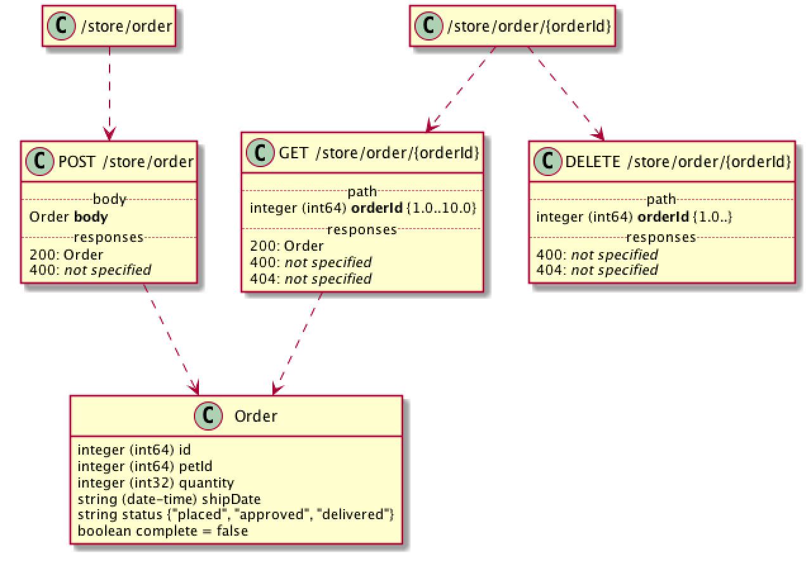

# Swagger to UML

A small pure Python script that converts [OpenAPI specifications](https://www.openapis.org) (a.k.a. [Swagger](https://swagger.io)) into [Plant UML](http://plantuml.com) diagrams. The goal is not to replace existing documentation generators, but to complement them with a visual representation of the routes, models, and their relationships.

## Example



To create a diagram from the [petstore example](http://petstore.swagger.io), call the script with:

```
python swagger_to_uml.py petstore_example/swagger.json
```

It will create the file `petstore_example/swagger.puml` which can then be translated into a PNG image with PlantUML with:

```
plantuml petstore_example/swagger.puml -tpng
```

Note you need to install [Plant UML](http://plantuml.com) and [Graphviz](http://www.graphviz.org) for this.

## Installation

The script runs with Python 3 without any additional packages. Python 2 requires installing the [typing](https://pypi.python.org/pypi/typing) backport.

On macOS, the installation of the required tools with [Homebrew](https://brew.sh) is simple:

```
brew install plantuml graphviz
```

## Contribute

The script is just a first proof-of-concept version. Issues and pull requests welcome!

## Copyright

MIT License

Copyright (c) 2017 Niels Lohmann <http://nlohmann.me>

Permission is hereby granted, free of charge, to any person obtaining a copy
of this software and associated documentation files (the "Software"), to deal
in the Software without restriction, including without limitation the rights
to use, copy, modify, merge, publish, distribute, sublicense, and/or sell
copies of the Software, and to permit persons to whom the Software is
furnished to do so, subject to the following conditions:

The above copyright notice and this permission notice shall be included in all
copies or substantial portions of the Software.

THE SOFTWARE IS PROVIDED "AS IS", WITHOUT WARRANTY OF ANY KIND, EXPRESS OR
IMPLIED, INCLUDING BUT NOT LIMITED TO THE WARRANTIES OF MERCHANTABILITY,
FITNESS FOR A PARTICULAR PURPOSE AND NONINFRINGEMENT. IN NO EVENT SHALL THE
AUTHORS OR COPYRIGHT HOLDERS BE LIABLE FOR ANY CLAIM, DAMAGES OR OTHER
LIABILITY, WHETHER IN AN ACTION OF CONTRACT, TORT OR OTHERWISE, ARISING FROM,
OUT OF OR IN CONNECTION WITH THE SOFTWARE OR THE USE OR OTHER DEALINGS IN THE
SOFTWARE.
